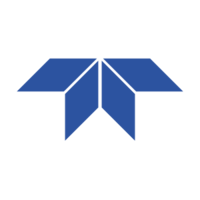
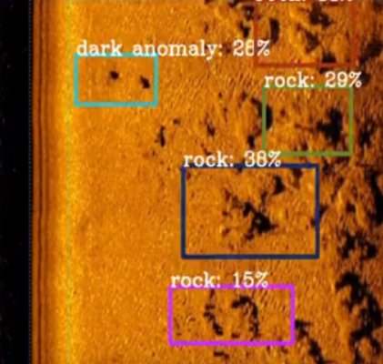
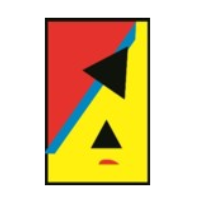
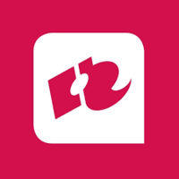

# Experiences

### [**Teledyne RESON**](https://www.teledynemarine.com/reson)
<h5> Software Engineer (Contractor), *sep. 2023 - current*</h5>
=== "Company"

    { align=left }
    text
    
=== "Role"
    text 

=== "PDS Maintenance"
    PDS is a huge software package primarily used for dredging and hydrographic purposes.

=== "GAVIA Project"
    <figure markdown="span">
        { width="900" }
        <figcaption></figcaption>
    </figure>
    Teledyne GAVIA has a serie of automatic underwater vessels (AUVs), which can be used for hydrographic surveying. Using various sensors such as side scan sonar or multibeam echosounders, the AUV can map the features of an underwater area for military, commercial or scientific applications. The modularity of the vessel gives it its ability to change onboard sensors, batteries, or payload capacity as desired. 

    <figure markdown="span" style="float: right; margin: 10px">
        { width="260" }
        <figcaption>(1) Example SSS Detections, [source](https://www.semanticscholar.org/paper/A-Deep-Learning-Approach-to-Target-Recognition-in-Einsidler-Dhanak/054b5e694d284eb44b92865b0f7c4178e9034911)</figcaption>
    </figure>
    The GAVIA project was a collaboration of two sister companies of Teledyne: RESON and GAVIA. The project 
    consisted of applying deep learning to detect targets in side scan sonar imagery, as seen in figure (1). In the collaboration, GAVIA would be 
    responsible for the AUV and SSS image processing, and RESON for 
    the machine learning side. 
    
    **My contributions** 
    <h5>1. Setting up a low-level communication protocol for receiving SSS images and returning detections.</h5>
    <h5>2. Programming middleware exposing a TensorRT engine built from an ONNX file.</h5>
    <h5>3. Creating a pipeline for dockerized releases, targeting a Jetson Orin Nano.</h5>
    <h5>4. Writing C4 documentation and manuals.</h5>

### [**ALTEN Netherlands** ](https://www.alten.nl/)
<h5>Software Consultant, *aug. 2023 - current*</h5>
=== "Company"

    { align=left }
    text
    
=== "Role"
    text 

=== "Teledyne RESON"
    To be filled in.

### [**Rotterdam UAS**](https://www.rotterdamuas.com/)
<h5>Teaching Assistant, *sep. 2020 - aug. 2022 · 2 jr*</h5>
=== "Company"

    { align=left }
    text
    
=== "Role"
    text 

=== "Programming"
    text 

=== "Hardware and Sensor Interfacing"
    text

=== "Operating System"
    text