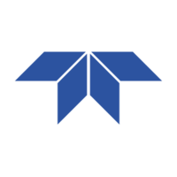
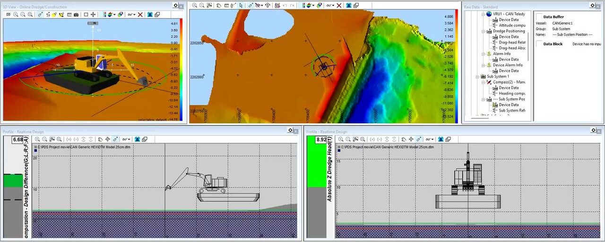
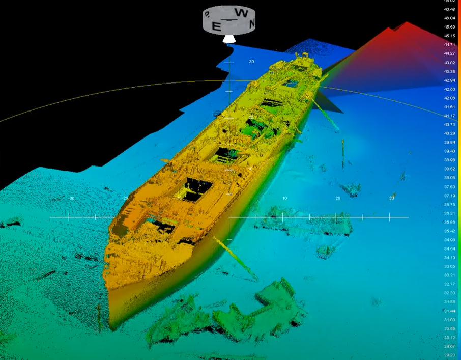
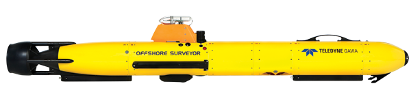
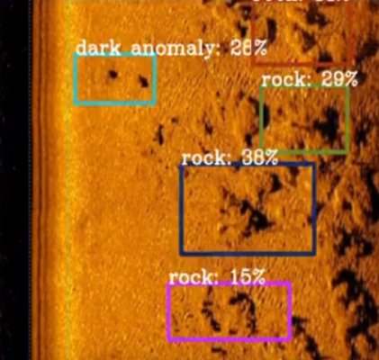

# Experiences

### [**Teledyne RESON**](https://www.teledynemarine.com/reson)
<h5> Software Engineer Contractor, sep. 2023 - current</h5>
=== "Company"

    { align=left }
    Teledyne RESON provides a range of hard- and software solutions for applications such as
    hydrography, civil engineering and dredging, defense & security, as well as marine research. 
    
    They are a recognized brand 
    within the domain for their excellent acoustic measurement instruments like the SeaBat or Hydrosweep multibeam echosounders,
    and Teledyne PDS software for surveying, data processing and dredge guidance.

=== "PDS Maintenance"
    <figure markdown="span">
        { width="900"}
        <figcaption>(1) Excavator dredging project.</figcaption>
    </figure>
    <figure markdown="span" style="float: right; margin: 10px">
        { width="300" }
        <figcaption>(2) DTM, [source](https://www.youtube.com/watch?v=8WRCPeDX_q0&list=PLm_GaaxwPaTovULyeYWI9Mds7e9MyYTzD&index=1&ab_channel=TeledynePDS)</figcaption>
    </figure>
    PDS is a huge software package feature full for hydro- graphic and dredging goals in mind. It consists of a code- base written in C++ that has been undergoing 
    development for several decades. 
    

    Typical PDS use consists of creating
    a simulated model (1) of an used dredging or survey setup (think of tools, vehicles and or sensors), which listen to sensor messages via TCP or UDP. The data
    gathered from these sensors will then be used for visual dredge guidance, 
    and or the creation of digital terrain models (DTM) (2).    

    

    **Contributions** 
    <h5>1. General maintenance; bug fixing and code refactoring using 
    Jira ticket system.</h5>
    <h5>2. Feature requests like graphical additions, device driver support or data exporters.</h5>
    <h5>3. Technical writing.</h5>

=== "GAVIA Project"
    <figure markdown="span">
        { width="900" }
        <figcaption></figcaption>
    </figure>
    Teledyne GAVIA - a sister company of RESON - has a serie of automatic underwater vessels (AUVs), which can be used for hydrographic surveying. Various sensors such as side scan sonar or multibeam echosounders make it possible for the AUV to map the features of an underwater area for military, commercial or scientific applications. The modularity of the vessel gives it its ability to change onboard sensors, batteries, or payload capacity as desired. 

    <figure markdown="span" style="float: right; margin: 10px">
        { width="250" }
        <figcaption>(1) Example, [source](https://www.semanticscholar.org/paper/A-Deep-Learning-Approach-to-Target-Recognition-in-Einsidler-Dhanak/054b5e694d284eb44b92865b0f7c4178e9034911)</figcaption>
    </figure>
    The GAVIA project 
    consisted of applying deep learning to detect targets in side scan sonar images, examplified in figure (1). 
    
    **Contributions** 
    <h5>1. Defining a low-level C++ TCP protocol for handling SSS images and detections.</h5>
    <h5>2. Programming C++ middleware with a GPU accelerated TensorRT core built from an ONNX files.</h5>
    <h5>3. Creating a pipeline for dockerized software releases, targeting NVIDIA Linux on a Jetson Orin Nano.</h5>

### [**ALTEN Netherlands** ](https://www.alten.nl/)
<h5>Technical Consultant, aug. 2023 - current</h5>
=== "Company"

    { align=left }
    text
    
=== "Role"
    text 

### [**Rotterdam UAS**](https://www.rotterdamuas.com/)
<h5>Teaching Assistant, sep. 2020 - aug. 2022 · 2 jr</h5>
=== "Company"

    { align=left }
    text
    
=== "Role"
    text 

=== "Programming"
    text 

=== "Hardware and Sensor Interfacing"
    text

=== "Operating System"
    text