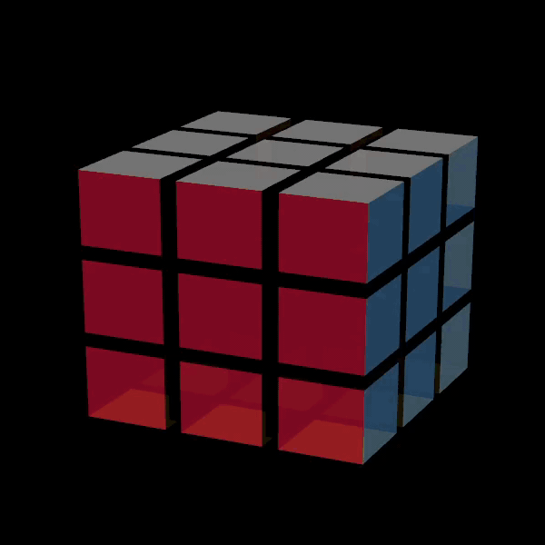

---
hide:
  - navigation
---

# Games 

-   <h1 style="margin-top:-10px; margin-bottom:-15px">
        *OpenGL Rubix Cube* 
    </h1>
     
    <h6 style="margin-top:-5px; margin-bottom:-10px;">
            Repository: [Python Rubix Cube](https://github.com/martijnlammers/martijnlammers.github.io/tree/py-rubix-cube) 
    </h6> 

    === ">"
    === "Description"
        
        This project originated as an assignment for my computer graphics course, which got 
        afterwork love since I thought it was a cool. The Rubix Cube
        is created out of 27 cube objects.
        The cube objects consist of 6 polygons with different colours.
        After creation, the cube is translated into the right position.

        When you rotate a slice, it'll replace the old cube colours with new cube colours. 
        Doing this was easier than rotating a layer, although I might consider doing this in the 
        future.

        After the rubix cube and colours are set in place, a light source was added.
        The small cubes were made slightly clear in order to give them a glassy effect.
        
    === "Tooling"
      
        `Programming languages`

            Python

        `Frameworks, libraries`

            OpenGL 
        
        `Development tools`

            Git

    === "Visuals"
        { width=400px align=center }

