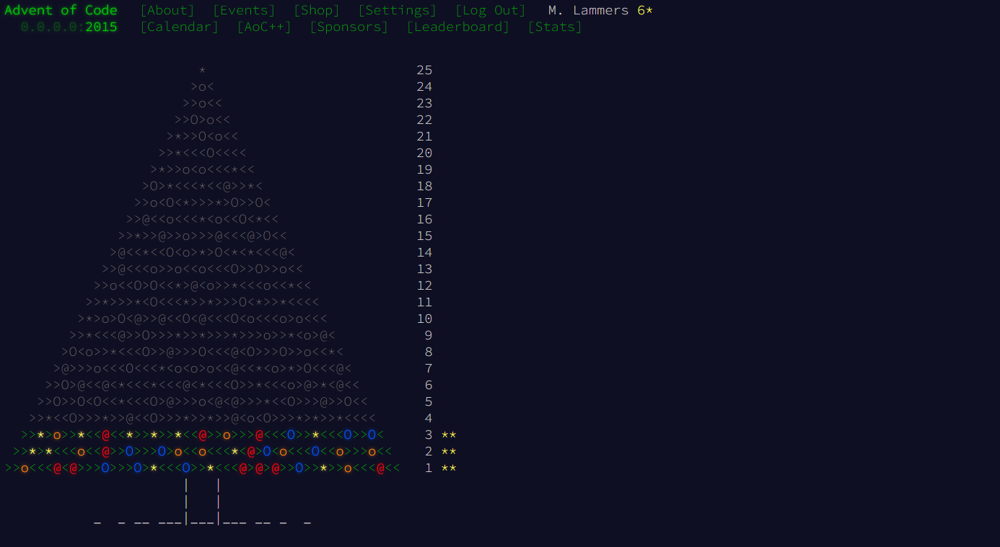

---
hide:
  - navigation
  - toc
---

# Coding Challenges

-   <h1 style="margin-top:-10px; margin-bottom:-15px">
        *Advent Of Code* 
    </h1>
     
    <h6 style="margin-top:-5px; margin-bottom:-10px;">
            Repository: [AdventOfCode](https://github.com/martijnlammers/AdventOfCode) 
    </h6> 

    === ">"
    === "Description"
        
        Advent Of Code is a annual coding challenge in the theme of christmas spirit. For 25 days long,
        a new puzzle with varying difficulty is unlocked. These challenges are an excellent excersise for 
        learning new programming languages and honing problem solving skills. 

        Participate or learn more here: [adventofcode.com](https://adventofcode.com/)
        
    === "Tooling"
      
        `Programming languages`

            Rust

        `Frameworks, libraries`

            N/A    
        
        `Development tools`

            Git

    === "Visuals"
        { align=center }

